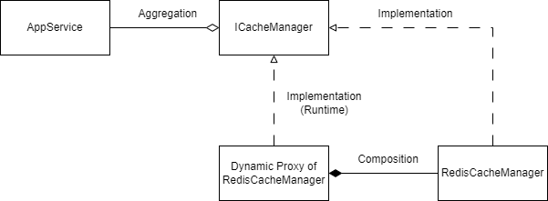

# ASP.NET Boilerplate (ABP) Redis Cache Exception Interceptor

A dynamic proxy (AOP) using [Castle](https://github.com/castleproject/Core) for intercepting the exception of Redis globally in runtime. In ABP, it will query Redis everytime when query database ([info](https://aspnetboilerplate.com/Pages/Documents/Caching)). However, `Abp.RedisCache` does not handle the error such as Redis connection refused.

## Class

All classes are under `com.trustmechain.SmartME.Application.AOP.Redis` namespace in `smartME_ApiBackend/src/SmartME.Application/AOP/Redis`.

- `RedisExceptionInterceptor`: The interceptor
- `RedisExceptionInterceptorRegistrar`: Proxy registrar, invoked by `SmartMEApplicationModule`