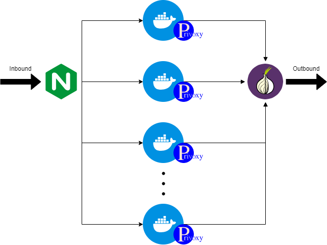

# Tor Proxy Cluster

Execute multiple [Tor Proxies](https://github.com/dperson/torproxy) with Docker Compose.

## Network Structure

A Tor Proxy is consist of `Privoxy` and `Tor` network. In order to use different Tor IP simultaneously, an `Nginx` load balancer is in front of Tor Proxies with using round-robin method.

Both Nginx and Tor Proxies are in same Docker network, which expose 3 ports:
- `8080`: Nginx index page
- `8118`: TCP port for Tor Proxies (round-robin)
- `8119`: Http port for health check of Tor Proxies (round-robin)

There are 3 Nginx config files, only `nginx.conf` is used. Another two are just for reference.

## Infra as Code

### Terraform

Terraform is used to create VM on Azure.

### Ansible

Ansible is used for installing Docker and Docker Compose on VM. Also, it can run Docker and Docker Compose remotely. However, the Docker Compose module currently only support via TCP and HTTP *but not SSH*. For sake of reducing complexity of setup, use **LOCAL** Docker Compose with SSH to run remotely.